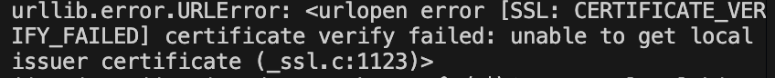
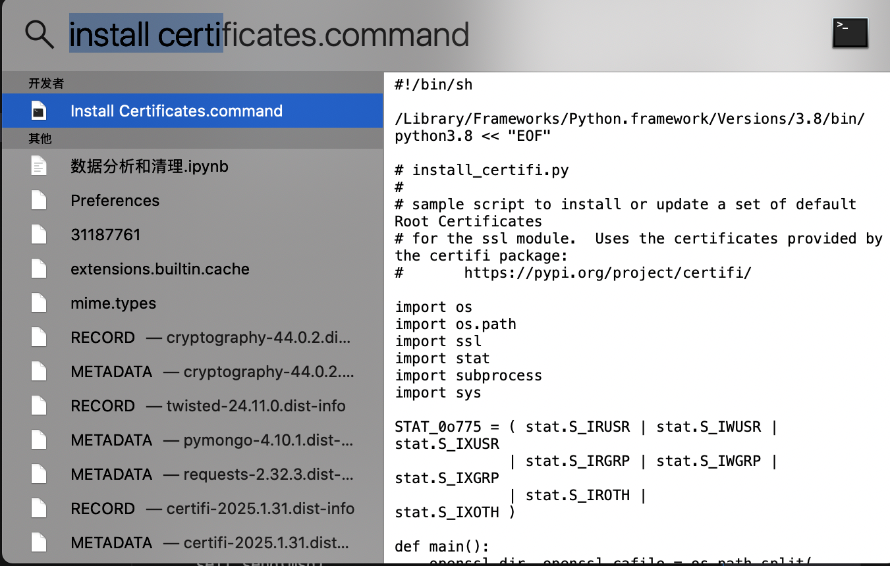

# 遇到的问题
## 环境问题
### pycharm能跑和vscode报错
 
 - CERTIFICATE_VERIFY_FAILED]certificate verify failed:unable to get local issure certificate
  
 - mac python出现SSL报错
 
#### 解决方案
-  command+空格搜索Install Certificates.command
-  双击Install Certificates.command安装文件
  
## 代码问题
- find_all写成find.all，报错find下没有all方法
- parser配置错误,html.parser中'.'写成','

## 感悟
- urllib模块下有很多子模块，用哪个子模块import哪个具体的
```
import urllib 
import urllib.request
#它们之间有区别
#一个模块是一个文件，import导入指定模块，

```
